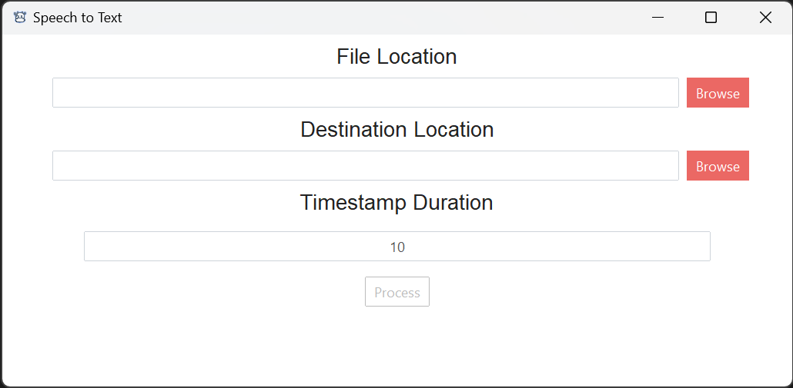

# Speech to Text

Speech to text from video to file txt, this app aim for people who want to transcribe a video that help of AI to write a scratch of transcribe than perfected by human.

# How to use

Browse a video or an audio, then select filepath for the result in txt file.

# Contribute

You can contribute to make the app better, just send a PR!

### How to build

I already create a script command in txt, that you can copy and build by yourself,

Don't forget run ```python -m venv env```, to create a virtual environment,

after that run ```& env/Scripts/Activate.ps1``` (for Windows),

then run ```pip install -r requirements.txt``` to install all libraries, that's all, cheers!